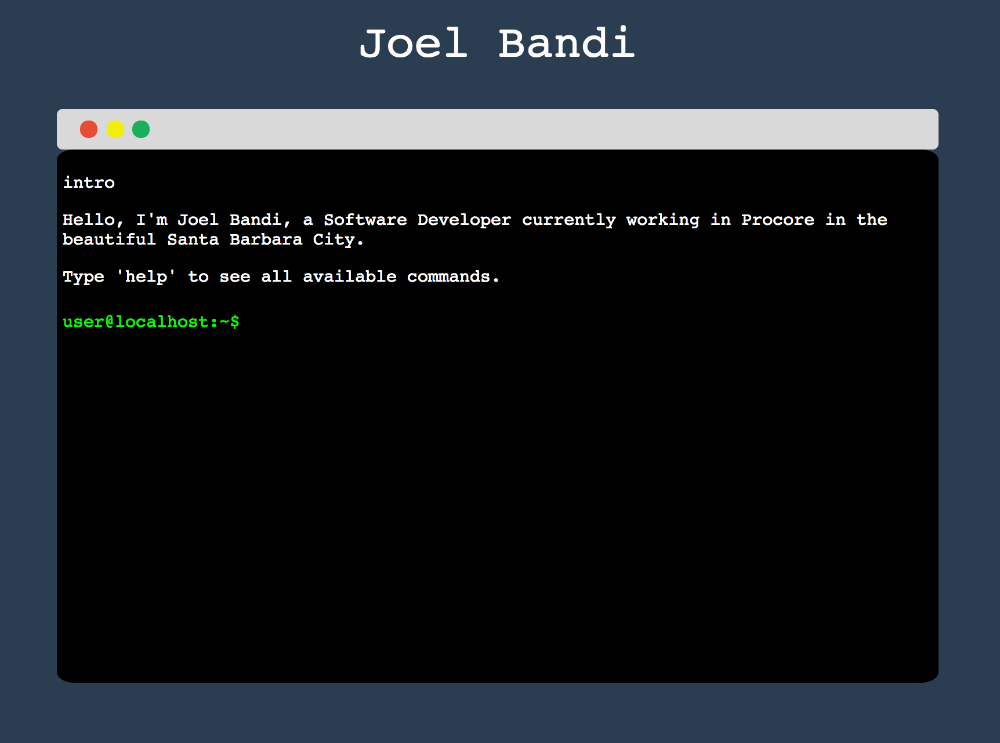

# terminal-about-me
*What is this?* A different take on an "about me" webpage using React+Redux  

## Building the application
1. `git clone https://github.com/joelbandi/terminal-about-me.git`.
2. Fill out your personal data in `/src/data.js`.
3. `npm install` or `yarn install`.
4. `npm start` to run development server.
5. Navigate to `localhost:8080`
6. `npm run build` when you want to create a production build in the `/dist` folder.

## Adding Features and links
1. Visit `/src/module.js` and follow step1, step2 and step3 as specified in the comments.
2. Put all your constants in `src/data.js` and export it from there.

See demo here -> [quaint-term.surge.sh](http://quaint-term.surge.sh/)
---

Happy Coding :heart:

Joel Bandi
